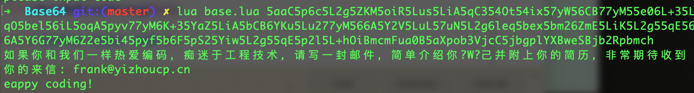

# Base64
if you want a job

> 算法方法是网上找的，对比实现了下，以下是比较熟悉的不同编程语言的解题版本，按照语言熟练度排序，原字符串是手打上来的，错不了

```
5aaC5p6c5L2g5ZKM5oiR5Lus5LiA5qC354Ot54ix57yW56CB77yM55e06L+35LqO5bel56iL5oqA5pyv77yM6K+35YaZ5LiA5bCB6YKu5Lu277yM566A5Y2V5LuL57uN5L2g6leq5bex5bm26ZmE5LiK5L2g55qE566A5Y6G77yM6Z2e5bi45pyf5b6F5pS25Yiw5L2g55qE5p2l5L+hOiBmcmFua0B5aXpob3VjcC5jbgplYXBweSBjb2Rpbmch
```

[TOC]

## Lua

- [Lua](./base.lua)

```
lua base.lua 5aaC5p6c5L2g5ZKM5oiR5Lus5LiA5qC354Ot54ix57yW56CB77yM55e06L+35LqO5bel56iL5oqA5pyv77yM6K+35YaZ5LiA5bCB6YKu5Lu277yM566A5Y2V5LuL57uN5L2g6leq5bex5bm26ZmE5LiK5L2g55qE566A5Y6G77yM6Z2e5bi45pyf5b6F5pS25Yiw5L2g55qE5p2l5L+hOiBmcmFua0B5aXpob3VjcC5jbgplYXBweSBjb2Rpbmch
```



## Python

- [Python](./base.py)

```
python base.py 5aaC5p6c5L2g5ZKM5oiR5Lus5LiA5qC354Ot54ix57yW56CB77yM55e06L+35LqO5bel56iL5oqA5pyv77yM6K+35YaZ5LiA5bCB6YKu5Lu277yM566A5Y2V5LuL57uN5L2g6leq5bex5bm26ZmE5LiK5L2g55qE566A5Y6G77yM6Z2e5bi45pyf5b6F5pS25Yiw5L2g55qE5p2l5L+hOiBmcmFua0B5aXpob3VjcC5jbgplYXBweSBjb2Rpbmch
```


## Objective-C

- [OC](./base.mm)

## C/C++

- [CPP](./base.cpp)

## Swift

- [Swift](./base.swift)

## JAVA

- [Java](./base.java)

## JS

- [JS](./base.js)

